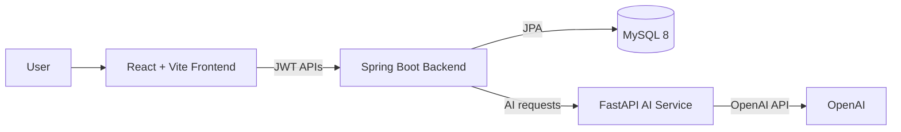
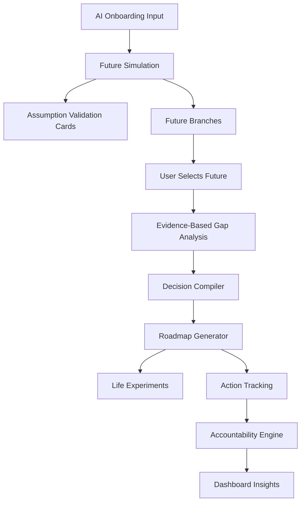
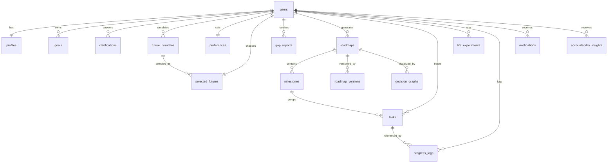

# FutureOS Architecture Diagrams

## System Architecture

```mermaid
flowchart LR
  User[User] --> FE[React + Vite Frontend]
  FE -->|JWT APIs| BE[Spring Boot Backend]
  BE -->|JPA| DB[(MySQL 8)]
  BE -->|AI requests| AI[FastAPI AI Service]
  AI -->|OpenAI API| OAI[OpenAI]
```

## AI Flow

```mermaid
flowchart TD
  Onboarding[AI Onboarding Input] --> Simulation[Future Simulation]
  Simulation --> Clarifications[Assumption Validation Cards]
  Simulation --> Branches[Future Branches]
  Branches --> Selection[User Selects Future]
  Selection --> Gap[Evidence-Based Gap Analysis]
  Gap --> Compiler[Decision Compiler]
  Compiler --> Roadmap[Roadmap Generator]
  Roadmap --> Experiments[Life Experiments]
  Roadmap --> Tasks[Action Tracking]
  Tasks --> Accountability[Accountability Engine]
  Accountability --> Insights[Dashboard Insights]
```

## Database Relationships

```mermaid
erDiagram
  users ||--|| profiles : has
  users ||--o{ goals : owns
  users ||--o{ clarifications : answers
  users ||--o{ future_branches : simulates
  users ||--|| preferences : sets
  users ||--|| selected_futures : chooses
  future_branches ||--o{ selected_futures : selected_as
  users ||--o{ gap_reports : receives
  users ||--o{ roadmaps : generates
  roadmaps ||--o{ milestones : contains
  roadmaps ||--o{ roadmap_versions : versioned_by
  roadmaps ||--o{ decision_graphs : visualized_by
  users ||--o{ tasks : tracks
  milestones ||--o{ tasks : groups
  users ||--o{ life_experiments : runs
  users ||--o{ progress_logs : logs
  tasks ||--o{ progress_logs : referenced_by
  users ||--o{ notifications : receives
  users ||--o{ accountability_insights : receives
```

## User Workflow

```mermaid
flowchart LR
  Login --> Onboarding
  Onboarding --> Assumptions[Assumption Validation]
  Assumptions --> Futures[Future Simulation]
  Futures --> Sliders[Preference Sliders]
  Sliders --> Select[Future Selection]
  Select --> Gap[Gap Analysis]
  Gap --> Compiler[Decision Compiler]
  Compiler --> Roadmap
  Roadmap --> Experiments[Life Experiment]
  Experiments --> Tracking[Action Tracking]
  Tracking --> Accountability[AI Accountability Loop]
  Accountability --> Improvement[Continuous Improvement]
```

